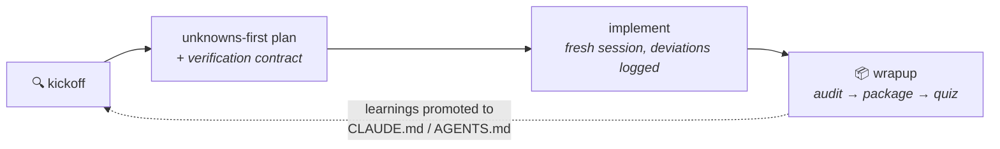

<div align="center">

# zhizhi（知之）

*zhī zhī — "to know it", from Analects 2.17*

**`kickoff` when you start &nbsp;·&nbsp; `wrapup` when you finish &nbsp;·&nbsp; `quiz-me` when you're not sure**

Three commands that find what you don't know you don't know — before it gets expensive.

[](https://agentskills.io)
[](#claude-code)
[](#openai-codex-cli)
[](./LICENSE)

**English** · [中文](./README.zh-CN.md)

</div>

---

## The problem

> 「知之为知之，不知为不知，是知也。」
>
> *"To know what you know, and to know what you do not know — that is knowledge."*
> — Confucius, Analects 2.17

Twenty-five centuries later, this is an engineering problem. Your prompt is a map. The
codebase — with its history, conventions, and half-finished adapters — is the territory.
Wherever they differ, the agent guesses. The more work you delegate, the more it guesses.

Confucius' definition unfolds into five states, and each needs a different tool:

| State | In agentic coding | Handled by |
|---|---|---|
| Knowing what you know | what's already in your prompt | solved |
| Knowing what you don't know | questions you know to ask, still unanswered | the interview |
| Not knowing what you know | "I'll know it when I see it" | prototypes |
| Not knowing what you don't know | the pothole you never considered | the blind spot pass |
| **Believing you know what you don't** | "it's stored in Redis" (it isn't) | the premise challenge |

The last row is the state the quote itself warns against — and the one the classic 2×2
misses, because it assumes your "knowns" are true.

But there's a paradox: **the person who most needs to find their blind spots is, by
definition, the person who doesn't know they have them.** You'll never think "I'm in
the third state right now, better run the technique for it."

So this toolkit doesn't ship a taxonomy to memorize. It ships **three moments you
already feel**:

## Three moments

### 🔍 `kickoff` — "I'm about to start"

Diagnoses your unknowns, then runs **only** the techniques that fire — a blind spot
briefing for unfamiliar territory, throwaway prototypes when you'll *know it when you
see it*, a one-question-at-a-time interview for open decisions, semantics extraction
from a reference — landing on a plan you can review in five minutes, whose verification
contract (checks, pass bars committed up front, who runs each) locks before
implementation starts.

```text
You:    /kickoff add SSO — I've never touched this app's auth module

Agent:  Two signals fired: unfamiliar territory, open decisions.
        Blind spot pass on src/auth first…

        · There's a half-finished OIDC adapter (PR #142, abandoned) — reuse or replace?
        · Sessions live in signed cookies; SSO tokens won't fit. Decision needed.
        · Question you didn't know to ask: which of the three login flows does SSO replace?

        Interviewing you next — one question at a time, architecture first.
```

If nothing fires, it says **"no meaningful unknowns — just implement"** and gets out of
the way. Kickoff is a diagnosis, not a ceremony.

### 📦 `wrapup` — "I just finished"

Audits the change first — re-running the plan's verification contract and reconciling
the diff against the logged deviations, so undocumented deviations are detected, not
confessed. Then packages the work into a buy-in doc that leads with the demo, hands you
the steps to run it yourself plus the two or three spots most worth a deep look, and
quizzes you on what actually changed — including the existing code paths diffs never
show. Merge is recommended only when the contract is green **and** you pass. Finally,
banks the session's surprises into permanent context.

### 🎯 `quiz-me` — "I'm not sure I understand this change"

The quiz alone: explain, test, grade strictly. Ends with an explicit
**PASS — you understand this change** or **NOT YET — misses on: <topics>**. Never
softened, so you can trust a PASS — which speaks to understanding only; whether the
change *works* is wrapup's audit's question.

## The loop



What you learn becomes the map for next time.

## What's inside

The eight techniques from Thariq's
[*A Field Guide to Fable: Finding Your Unknowns*](https://x.com/trq212/article/2073100352921215386)
are all here — plus two the framework logically demands. The **premise challenge**: the
unknowns matrix assumes your "knowns" are true, but the most expensive failures come
from false confidence, so kickoff falsifies what you treat as fact. And its mirror, the
**verification audit**: after implementation the same false-confidence risk sits with
the implementer, so wrapup falsifies what the implementation claims — against the diff
and the running system, never against its own story.

All of them live as the agent's internal toolbox (`references/` in each skill), loaded
only when needed. You never have to name them:

| You say… | Kickoff reaches for |
|---|---|
| "I've never touched this part of the codebase" | Blind spot pass |
| "It's stored in Redis, nothing else calls it" | Premise challenge |
| "Show me options — I'll know it when I see it" | Brainstorm & throwaway prototypes |
| "Not sure this is even possible" | Feasibility spike |
| "There are decisions I haven't made" | One-question-at-a-time interview |
| "Make it work like this library" | Reference semantics extraction |
| "OK, ready to build" | Unknowns-first plan + implementation notes |

<details>
<summary><b>Peek inside the toolbox</b></summary>
<br/>

| Technique | Phase | What it does | Doc |
|---|---|---|---|
| Blind spot pass | before | Explores unfamiliar territory, briefs you on the questions you didn't know to ask, potholes, prior art, and what good looks like | [blindspot.md](./skills/kickoff/references/blindspot.md) |
| Premise challenge | before | Harvests everything treated as fact — yours and the agent's — and verifies it against the territory with evidence: CONFIRMED / FALSE / UNVERIFIABLE | [challenge.md](./skills/kickoff/references/challenge.md) |
| Brainstorm & prototypes | before | 5–10 approaches ranked cheapest → most ambitious, or 3–4 wildly different single-file HTML mockups; your reactions become explicit criteria | [brainstorm.md](./skills/kickoff/references/brainstorm.md) |
| Feasibility spike | before | Smallest experiment that yields a yes/no with measured evidence; pass/fail bar defined before running it | [brainstorm.md](./skills/kickoff/references/brainstorm.md) (Mode C) |
| Interview | before | One question at a time, biggest architectural blast radius first, each with a suggested default; ends in a paste-ready decision log | [interview.md](./skills/kickoff/references/interview.md) |
| Reference extraction | before | Reads a reference's actual source, produces a keep/adapt/drop semantics checklist before any code is written | [use-reference.md](./skills/kickoff/references/use-reference.md) |
| Unknowns-first plan | before | Most-likely-to-change decisions on top (with confidence + what would flip them); mechanical work buried at the bottom | [plan.md](./skills/kickoff/references/plan.md) |
| Implementation notes | during | Logs decisions, deviations, and surprises as they happen; conservative option + keep going — and when deviations pile up, triggers a re-diagnosis instead of patching a broken plan | [impl-notes.md](./skills/kickoff/references/impl-notes.md) |
| Verification audit | after | Re-runs the plan's contract, reconstructs the real deviation set from the diff, grades the implementation's claims — the premise challenge pointed at the implementer | [audit.md](./skills/wrapup/references/audit.md) |
| Pitch & explainer | after | One demo-first buy-in doc that answers reviewers' objections before they ask | [pitch.md](./skills/wrapup/references/pitch.md) |
| Understanding quiz | after | Report covering what diffs don't show, then a strictly graded quiz — the understanding axis of the merge verdict | [quiz.md](./skills/wrapup/references/quiz.md) |

</details>

Wrapup closes two loops, not one: it promotes this session's surprises into permanent
context (better map), and asks *which barrier should have caught this — a kickoff
technique that didn't fire, a contract line never written — and why didn't it* (better
map-making).

## Install

#### Claude Code

```
/plugin marketplace add lusipad/zhizhi
/plugin install zhizhi@zhizhi
```

#### OpenAI Codex CLI

```sh
git clone https://github.com/lusipad/zhizhi.git
cd zhizhi && ./install.sh --codex
```

Windows: `.\install.ps1 -Codex`

#### Universal (Claude Code + Codex + Cursor + more)

```sh
npx skills add lusipad/zhizhi
```

#### Manual

Each skill is a plain folder with a `SKILL.md`. Copy any folder from `skills/` into
your agent's skills directory (`~/.claude/skills/`, `~/.codex/skills/`, …).

### Three always-on rules

Two things nobody remembers to trigger: keeping implementation notes mid-task, and
reviewing before merge. One canonical file —
[`rules/unknowns-rules.md`](./rules/unknowns-rules.md) — delivered in each host's
native shape, so there are no copies to drift:

| Host | How the rules arrive |
|---|---|
| Claude Code (plugin) | **Automatic** — a SessionStart hook injects them (works in sh and PowerShell; disable the plugin to opt out) |
| Claude Code / Codex (cloned) | `./install.sh --rules <project>` appends them to `CLAUDE.md` / `AGENTS.md` (idempotent) |
| Cursor | the same command writes `.cursor/rules/zhizhi-unknowns.mdc` when the project has `.cursor/` |
| Windsurf | the same command writes `.windsurf/rules/zhizhi-unknowns.md` when the project has `.windsurf/` |
| `npx skills` / anything else | copy the three lines by hand |

Windows: `.\install.ps1 -Rules D:\your\project`.

## Multilingual

Instructions are written in Chinese (the project's home language); verdict anchor
tokens (VERIFIED / FAILED / PASS / NOT YET / DEFERRED …) and code identifiers stay in
English — they are the cross-language trust anchors that downstream artifacts search
for. Every skill requires user-facing output — briefings, questions, quizzes,
verdicts — **in the language you're speaking**, so the skills work unchanged for
non-Chinese users. Triggering works in any language via semantic matching; trigger
words in both languages (开工 / kickoff, 收工 / wrapup, 考考我 / quiz me) are built
into the descriptions.

## Design principles

- **Moments, not taxonomy.** People reliably feel *starting* and *finishing*; they don't
  reliably notice "I have unknown knowns." Commands map to the former; the agent handles
  the latter.
- **Progressive disclosure.** Three entry points; the techniques as reference files
  read on demand — cheap on context until needed.
- **Portable by construction.** Frontmatter is only `name` + `description` (the open
  [Agent Skills](https://agentskills.io) format); bodies contain no agent-specific tool
  names.
- **Honest exits（不知为不知）.** When you don't know, say you don't know: "just
  implement" and "NOT YET" are first-class outcomes, not failures.
- **The author is never the judge.** The plan pre-commits its pass bars before results
  exist; the implementer records evidence but never grades it; the audit re-runs checks
  instead of trusting logs; and understanding (PASS) is never conflated with
  correctness (the contract tally). Boundaries are drawn by ownership — intent, value
  tradeoffs, irreversible actions, security surface, outward promises always stop and
  ask — not by capability, which shifts with every model release.
- **Narrative is not evidence.** A session's story of what it did is a map. Verdicts
  come from re-running commands and reading diffs — the territory — and every "it
  works" claim cites something visible.

### Honest limits（对自己也一样）

- A skill pack can instruct, not enforce — everything here is honor-system. The design
  bets on making honesty the path of least resistance: re-running a listed command is
  easier than faking it.
- The contract's two-copy lock detects drift, not adversaries — a session that controls
  the disk can rewrite both copies.
- A same-session audit cannot be blind; the "(self-audited)" tag is the honest part.
  Where the host offers a second model or subagents, use them — an AI verifier shares
  lineage with the AI implementer, and correlated blind spots remain either way.
- A per-project trust ledger — ceremony that relaxes as track record accumulates — is
  future work.

## Credits & license

Concepts from [Thariq (@trq212)](https://x.com/trq212)'s
[*A Field Guide to Fable: Finding Your Unknowns*](https://x.com/trq212/article/2073100352921215386),
and the Analects, 2.17. MIT — see [LICENSE](./LICENSE).
